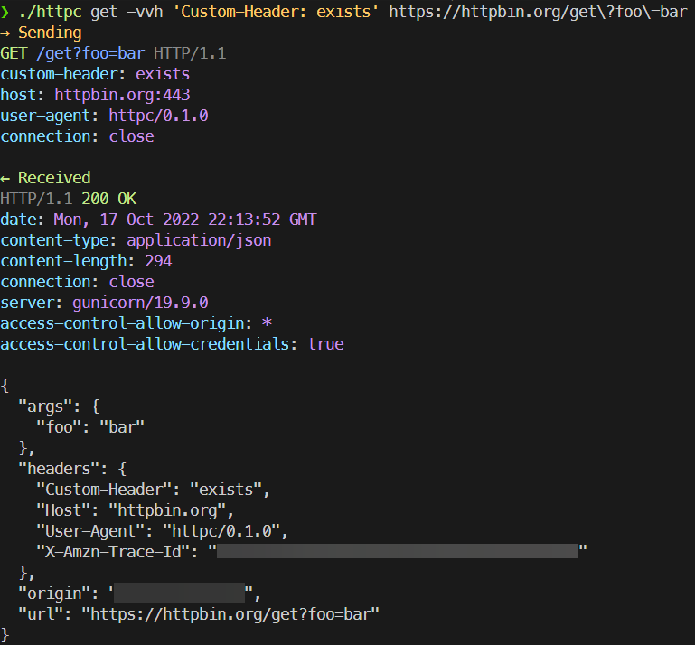

# rust-http

Implementing a CLI HTTP 1.1 client from (mostly) scratch in Rust, using:

- [Clap](https://docs.rs/clap/latest/clap/) for argument parsing
- [hyperium/http](https://docs.rs/http/latest/http/) for HTTP request/response types
  - This crate is intended to be a set of "common" types, so theoretically this client could work with any other rust code that expects request/response types from this crate
  - Please dont actually use it like that, use another library that's properly maintained
- [native_tls](https://docs.rs/native-tls/latest/native_tls/) for HTTPS support using native OS implementations

Building request messages and parsing response messages is all manually done for fun.

cURL-inspired, of course.



## Usage

```bash
# GET request (shows response body)
$ httpc get https://httpbin.org/get
# GET request but verbose (includes response headers)
$ httpc get -v https://httpbin.org/get
# GET request but very verbose (includes request HTTP message + Response headers)
$ httpc get -vv https://httpbin.org/get
# Query parameters are provided in the URI (make sure you escape the characters according to your shell)
$ httpc get 'https://httpbin.org/get?foo=123&bar=456'
# POST request with data (Content-Length is automatically calculated and set, you only need to provide Content-Type)
$ httpc post -h 'Content-Type: application/json' -d '{"cool": 1}' https://httpbin.org/post
# POST request with data from a file
$ httpc post -h 'Content-Type: application/json' -f ./data.json https://httpbin.org/post
# GET request and save response body to a file
$ httpc get -o ./file.json https://httpbin.org/get
# GET request and follow redirects
$ httpc get -lv https://httpbin.org/redirect/3
```

## Building

```bash
cargo build
```

This builds a debug release for your current platform, for release builds use `--release` and for other platforms see [the rustup docs](https://rust-lang.github.io/rustup/cross-compilation.html)

## Why?

School gave me this as an assignment. They suggested C, Go, Python, Java, or NodeJS. I wanted to learn Rust, so I get to enjoy borrow-checking.

## TODO

(?) = If I have time

- (?) Reuse connection for following redirects? (map host -> connection?)
- (?) Return `Response<SomeKindOfStream>`? Display headers while the body loads (or even incrementally display body?)
- (?) Progress bar? `-p`
